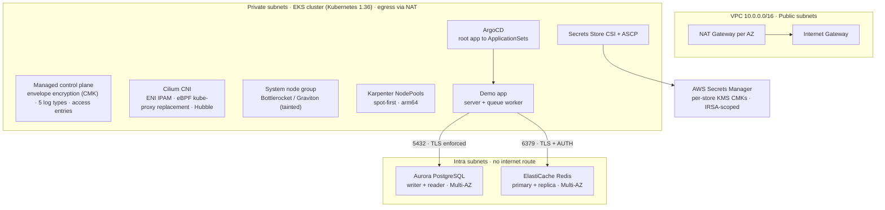
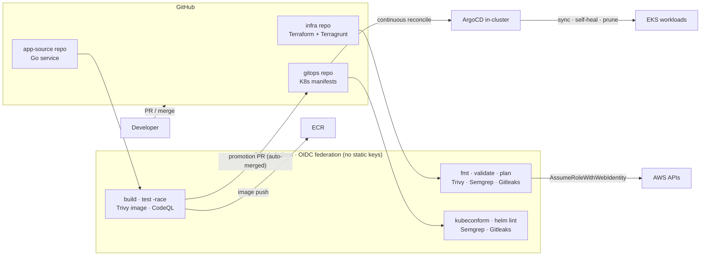
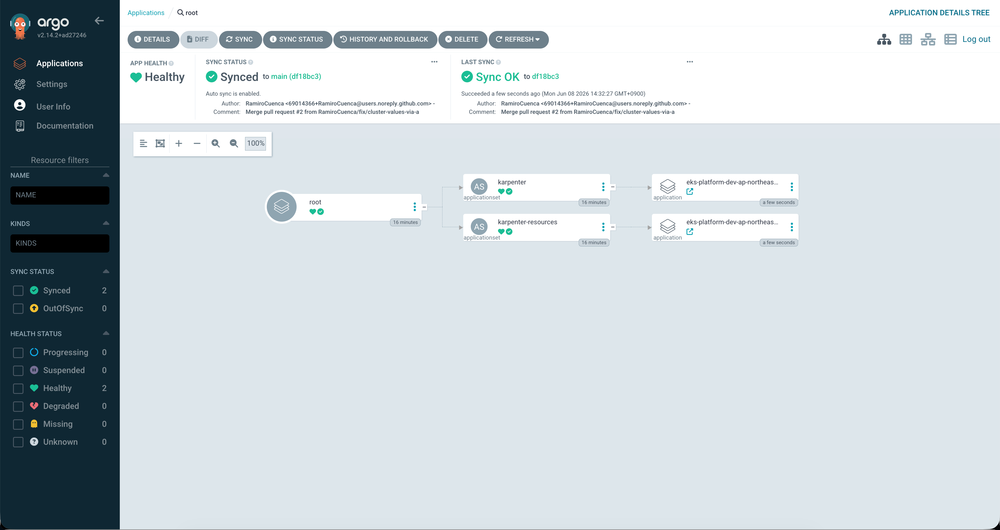
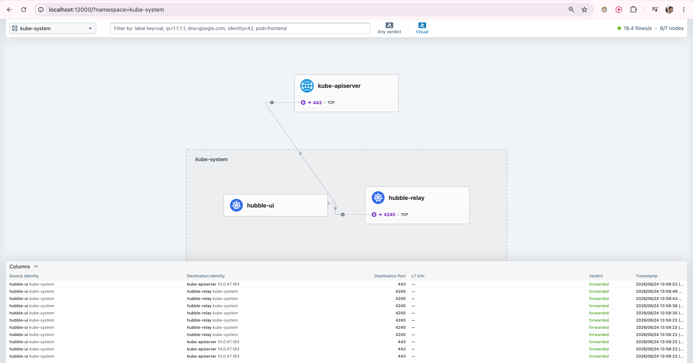
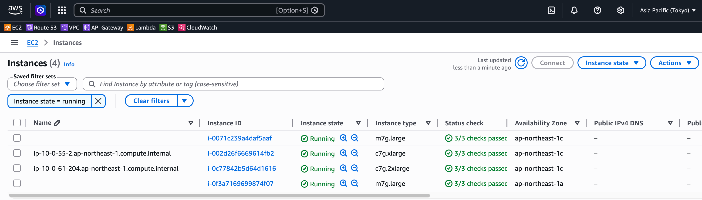
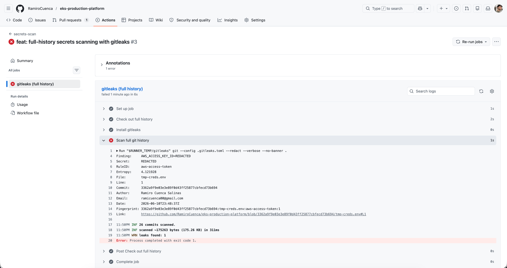

# eks-production-platform

A production-grade Amazon EKS platform built with Terragrunt, Cilium, ArgoCD, and a layered DevSecOps pipeline, designed around the architectural concerns of scale-conscious, security-first engineering organisations, with every non-trivial decision documented alongside the alternatives it was chosen over.

[](https://github.com/RamiroCuenca/eks-production-platform/actions/workflows/terraform.yml)
[](https://github.com/RamiroCuenca/eks-production-platform/actions/workflows/sast.yml)
[](https://github.com/RamiroCuenca/eks-production-platform/actions/workflows/secrets-scan.yml)

---

## Table of contents

- [What this is](#what-this-is)
- [Architecture](#architecture)
- [Three-repository topology](#three-repository-topology)
- [Technology stack](#technology-stack)
- [Architecture & decisions](#architecture--decisions)
- [Security model](#security-model)
- [DevSecOps pipeline](#devsecops-pipeline)
- [AWS Well-Architected alignment](#aws-well-architected-alignment)
- [Deployment evidence](#deployment-evidence)
- [Roadmap](#roadmap)
- [Repository layout](#repository-layout)
- [Deploy from zero](#deploy-from-zero)
- [Cost & lifecycle](#cost--lifecycle)
- [License](#license)

---

## What this is

This repository provisions a multi-region, multi-environment EKS platform on AWS. The emphasis is **depth in the areas that distinguish production maturity**: the security model (IRSA, least-privilege IAM, customer-managed encryption, network isolation), the eBPF networking layer (Cilium full CNI replacement with Hubble), GitOps delivery (ArgoCD with a clean IaC↔GitOps boundary), and a layered DevSecOps pipeline that blocks on findings, rather than breadth-for-its-own-sake across every possible component.

Two principles run through the whole design:

1. **Documented tradeoffs.** Every meaningful choice records what was picked, what was considered, and why. Where a simpler or "default" path was rejected (EKS Auto Mode, the `aws-auth` ConfigMap, DynamoDB state locking, CNI chaining, branch-per-environment GitOps), the rejection is deliberate and explained, see [Architecture & decisions](#architecture--decisions).
2. **Build → screenshot → destroy.** The repository is the durable artifact, not a permanently-running cluster. Infrastructure is stood up, validated, evidenced under [`docs/screenshots/`](docs/screenshots/), and torn down with `terragrunt run --all destroy`. This keeps cost bounded and demonstrates FinOps discipline.

Where it runs: both environments span `ap-northeast-1` (Tokyo, primary) and `ap-northeast-2` (Seoul, DR), a real Asia-Pacific production pair rather than the `us-east-1` tutorial default.

> **Project status.** The platform foundation (networking, EKS + Karpenter, Cilium/Hubble, ArgoCD/GitOps, Secrets Manager + IRSA, the Aurora + ElastiCache data tier, the private ECR registry with its OIDC publish identity, and the full DevSecOps CI pipeline) is **built and evidenced** with console/CLI screenshots under [`docs/screenshots/`](docs/screenshots/). The Go demo application is **implemented with green CI**: every merge publishes a multi-arch image to the platform registry and promotes its tag into the GitOps repository through an auto-merged, gate-checked pull request ([companion repo](https://github.com/RamiroCuenca/eks-platform-demo-app)); its in-cluster deployment evidence, the observability stack, and the autoscaling/load-test work are **on the [Roadmap](#roadmap)**. Every claim in this README traces to a file in the repository or a screenshot in `docs/`.

---

## Architecture

### Runtime architecture (one environment / region)



*All of the above sits in one AWS account, in `ap-northeast-1` (Tokyo) with an identical mirror in `ap-northeast-2` (Seoul) for DR. ArgoCD reconciles in-cluster workloads from the GitOps repository; the demo app reads its credentials from Secrets Manager through the IRSA-scoped CSI mount and reaches the data tier over TLS only.*

### CI/CD & GitOps delivery (three repositories)



*A higher-fidelity diagram (`docs/architecture.png`) may replace these Mermaid renders in a later pass; the Mermaid versions are version-controlled and need no external tooling.*

### Highlights

A few shots from the running platform; the full, captioned set is indexed under [Deployment evidence](#deployment-evidence).

| | |
|:---:|:---:|
| [](docs/screenshots/argocd/) | [](docs/screenshots/cilium/) |
| **GitOps:** ArgoCD App-of-Apps tree, synced and healthy | **eBPF networking:** Hubble live flow graph |
| [](docs/screenshots/argocd/) | [](docs/screenshots/ci/) |
| **Autoscaling:** Karpenter-provisioned spot fleet | **DevSecOps:** secret-scanning gate blocking a planted credential |

---

## Three-repository topology

The platform is split across three repositories whose boundaries follow the team, cadence, and blast-radius boundaries that already exist in production work:

| Repository | Owns | Pipeline |
|---|---|---|
| **[eks-production-platform](https://github.com/RamiroCuenca/eks-production-platform)** (this repo) | AWS infrastructure (VPC, EKS, IAM, KMS, Secrets Manager, the data tier) as Terraform driven by Terragrunt | `terraform`, `sast`, `secrets-scan` |
| **[eks-platform-gitops](https://github.com/RamiroCuenca/eks-platform-gitops)** | Kubernetes manifests, Helm values, and ArgoCD Applications (App-of-Apps), reconciled continuously by ArgoCD | `manifests` (kubeconform + helm), `sast`, `secrets-scan` |
| **[eks-platform-demo-app](https://github.com/RamiroCuenca/eks-platform-demo-app)** | The Go application source and its build/test/scan pipeline | `ci` (build + test + Trivy), `codeql` |

The rule of thumb: *if it requires AWS credentials to create → Terraform, infra repo; if it's a Kubernetes manifest → gitops repo, ArgoCD-applied; application source and its container build → app repo.* The one acknowledged bootstrap exception is ArgoCD itself, which Terraform installs via `helm_release` so that everything else can flow through GitOps from that point forward. Splitting application source from configuration is the documented ArgoCD best practice; folding source into the config repo reads as a GitOps anti-pattern. New application images are promoted by a CI commit that updates the image tag in the gitops repo, keeping every deployment an auditable Git event.

---

## Technology stack

| Layer | Choice | One-line rationale |
|---|---|---|
| IaC | **Terragrunt + Terraform** | Layered `global → account → region → module` config eliminates duplication across environments/regions while keeping module code reusable. |
| Cloud | **AWS** | Broadest production-DevOps relevance and the maturity of its EKS, IRSA, and Secrets Manager primitives. |
| Orchestration | **EKS** (managed control plane) | Managed control plane with envelope encryption, all five log types, and access-entry authentication. |
| Compute scaling | **Karpenter** | Bin-packing and instance-type flexibility over Cluster Autoscaler; spot-first on Graviton. |
| CNI / networking | **Cilium + Hubble** (eBPF) | Full replacement of VPC CNI **and** kube-proxy, ENI IPAM, eBPF service routing, identity-aware network policy, flow observability. |
| GitOps | **ArgoCD** (separate config repo) | Continuous reconciliation with Git as the source of truth; one ArgoCD per cluster. |
| Secrets | **Secrets Manager + IRSA + ASCP** | Per-workload IAM scoped to the exact secret ARN; values delivered as a tmpfs CSI mount, never synced into etcd. |
| Database | **Aurora PostgreSQL** (Multi-AZ) | Writer + reader in separate AZs; RDS-managed credential rotation; server-enforced TLS. |
| Cache | **ElastiCache Redis** (Multi-AZ) | Replication group with automatic failover, at-rest (CMK) + in-transit (TLS) encryption, and AUTH. |
| Demo workload | **Go** microservice, *implemented; deployment evidence pending* | Dependency-light stdlib HTTP service + queue worker on a distroless non-root image. [Source + CI ↗](https://github.com/RamiroCuenca/eks-platform-demo-app) [](https://github.com/RamiroCuenca/eks-platform-demo-app/actions/workflows/ci.yml) [](https://github.com/RamiroCuenca/eks-platform-demo-app/actions/workflows/codeql.yml) |
| CI/CD | **GitHub Actions** (OIDC to AWS) | Short-lived role-assumed credentials, no static keys; SHA-pinned actions; strict-fail security gates. |
| Load testing | **k6**, *designed; see Roadmap* | JS-scripted load with results streamed to Grafana to visualise scaling. |
| Observability | **kube-prometheus-stack + Loki**, *designed; see Roadmap* | Metrics, logs, alerting, and a cost-by-namespace FinOps panel. |

---

## Architecture & decisions

Each entry below is the public summary of a fuller internal decision record. Categories are collapsible, skim the headers, expand what's relevant.

<details>
<summary><strong>Foundation, Terragrunt structure, state, and environments</strong></summary>

- **Layered configuration.** Config cascades through `root.hcl → global.hcl → account.hcl → region.hcl → module inputs`, with tags merged through the same hierarchy and applied via AWS provider `default_tags`. Reusable Terraform lives under `modules/`, instantiated by Terragrunt wrappers per environment/region.
- **Module ordering by dependency graph, not filename.** Modules use semantic directory names; deployment order is expressed through Terragrunt `dependency` blocks (the graph the tool actually walks) rather than numeric filename prefixes.
- **Single account, structurally multi-environment.** All environments deploy into one AWS account for cost reasons; the `dev/` and `prod/` structure with per-environment state, tags, and naming preserves full separation, and the layout is designed so a real engagement could split into separate accounts with config-only changes.
- **Multi-region, topology-symmetric.** Both environments deploy across Tokyo and Seoul; `dev` and `prod` share identical topology and differ only in resource sizing, retention windows, and API access CIDRs, so dev can validate the same operational and DR workflows that run in prod, guarding against the "works in dev, breaks in prod" anti-pattern.
- **State bootstrap decoupled from the pipeline.** A small standalone Terraform configuration in `bootstrap/` creates the per-environment S3 state bucket, keeping the chicken-and-egg state bootstrap out of the Terragrunt pipeline and `destroy` symmetric with `apply`.
- **S3-native state locking.** Locking uses Terraform's `use_lockfile` (S3 conditional writes), removing the DynamoDB lock table entirely and aligning with current HashiCorp guidance.
- **Fork-friendly identifiers.** State bucket names embed the AWS account ID (resolved from an environment variable, never committed) for global uniqueness, so the platform applies to any AWS account by configuration only.

</details>

<details>
<summary><strong>Networking</strong></summary>

- **Three-tier subnets per `/16` VPC, 2 AZs.** Public (load balancers), private (workloads, NAT egress), and **intra** (data tier, *no default route in either direction*). Least-privilege is locked at the network layer in addition to IAM; non-overlapping CIDRs across all four VPCs preserve future cross-region peering without re-IP'ing.
- **NAT per AZ in both environments.** Identical egress topology in dev and prod so AZ-level failure modes are validated before they reach prod.
- **VPC endpoints sized to utility.** Free gateway endpoints (S3, DynamoDB) ship with every VPC; interface endpoints are added alongside the workloads that consume them, keeping AWS API traffic on the backbone instead of crossing NAT.
- **Flow logs always on.** Every VPC ships flow logs to CloudWatch with 30-day retention, the network-layer audit trail for incident response and anomaly detection.

</details>

<details>
<summary><strong>EKS cluster design</strong></summary>

- **Deliberate compute shape, not Auto Mode.** Managed control plane + a small managed system node group + Karpenter-provisioned NodePools for application workloads. **EKS Auto Mode was evaluated and not adopted**; NodePool config, IRSA bindings, AMI family, and disruption policy are surfaced deliberately to retain operational control and keep the compute lifecycle reviewable.
- **Latest standard-support version, canary upgrades.** Both environments target the latest EKS standard-support Kubernetes version (currently **1.36**); upgrades follow dev → soak → prod, and the cluster version is a required per-environment input with no hidden defaults.
- **Public + private endpoints with a hardening delta.** The private endpoint carries all in-VPC traffic; the public endpoint is allowlisted on prod (operator IP + GitHub Actions ranges) and open-but-IAM-authenticated on dev, demonstrating the dev-vs-prod hardening difference without adding a VPN or bastion.
- **All five control-plane log types** shipped to CloudWatch; the log group is Terraform-managed with explicit 30-day retention, avoiding the EKS-default "Never expire" anti-pattern.
- **Access entries, not `aws-auth`.** Authentication runs in `API` mode with IAM-to-cluster bindings declared as Terraform resources, eliminating the bootstrap lockout risk and YAML drift of the legacy ConfigMap and giving every grant a CloudTrail trail.
- **Per-cluster envelope encryption.** Kubernetes Secrets are encrypted at rest with a customer-managed KMS key per cluster (annual rotation); decryption requires *both* etcd access and explicit `kms:Decrypt`, defense-in-depth beyond the default `aws/ebs`-encrypted etcd volume.

</details>

<details>
<summary><strong>Compute & autoscaling (Karpenter)</strong></summary>

- **Hybrid install across the IaC/GitOps boundary.** Terraform owns the controller IRSA role, the EC2 instance profile, and the SQS interruption queue (resources that need AWS credentials); the Helm chart, NodePool, and EC2NodeClass live in the gitops repo. The EKS Add-on path was evaluated and not adopted to keep NodePool design and version cadence explicit.
- **NodePool defaults: Bottlerocket on Graviton, spot-first.** Immutable container-optimised OS (no shell, atomic updates), arm64 for ~20% price/performance with a parallel amd64 fallback pool, spot-first with on-demand fallback, aggressive consolidation, and a 30-day `expireAfter` that enforces kernel/AMI rotation as a security-hygiene baseline. Specialised pools follow a documented expansion pattern that needs only a gitops PR.
- **Spot interruption handling.** Karpenter watches the SQS interruption queue (fed by EventBridge) and drains nodes within the two-minute reclamation warning.

</details>

<details>
<summary><strong>CNI & network policy (Cilium / eBPF)</strong></summary>

- **Full replacement of VPC CNI *and* kube-proxy**, chosen over CNI chaining so the platform demonstrates an eBPF datapath end-to-end (pod networking via ENI IPAM, eBPF service load-balancing, policy enforcement, Hubble) rather than a bolt-on policy layer. kube-proxy is removed entirely, eliminating the iptables rule-chain that scales with service count.
- **Cilium installs as a bootstrap primitive between the control plane and the node group**, so the CNI is present before any node joins, the managed node group reaches `ACTIVE` normally (its readiness gate doubling as proof Cilium networked the nodes), and Cilium is the sole CNI from the first node, no VPC CNI, no DaemonSet swap, fully declarative. *(Three earlier bootstrap approaches were tried on real clusters and rejected; the final design and the rejected alternatives are both recorded.)*
- **ENI IPAM (native VPC pod IPs), masquerade off.** Pods keep routable VPC addresses (preserving flow-log correlation and east-west routing); segmentation is handled by identity-aware CiliumNetworkPolicy rather than security-group-per-pod.
- **Scoped operator IRSA.** ENI-management permissions land on the Cilium operator's ServiceAccount via IRSA, never on the node role.
- **Default-deny network policy, GitOps-managed.** Application namespaces run a default-deny CiliumNetworkPolicy baseline (with explicit DNS and intra-namespace allows); per-workload allow rules version alongside the workloads they describe.
- **Karpenter ↔ Cilium startup taint.** Karpenter nodes carry a `node.cilium.io/agent-not-ready` taint that blocks scheduling until the datapath is programmed, eliminating the launch-time race where a node reports Ready before its networking exists.

</details>

<details>
<summary><strong>GitOps & delivery (ArgoCD)</strong></summary>

- **One ArgoCD per cluster**, bootstrapped by the same Terraform that brings the cluster up, bounding blast radius and keeping each cluster's deployment plane self-sufficient. Hub-and-spoke is documented as the scale-up pattern for managing fleets of short-lived clusters.
- **Account-specific facts via a cluster-Secret bridge.** Values Terraform produces (IRSA role ARNs, SQS queue names, cluster name, region) are written into an ArgoCD cluster Secret; ApplicationSets render per-cluster Applications from it, keeping account identifiers out of the public config repo and scaling to more clusters with no per-cluster gitops changes.
- **Environment separation by label, not branch.** The gitops repo tracks a single `main`; ApplicationSets target clusters by `env` label. Branch-per-environment was rejected for configuration drift, non-atomic cross-env changes, and opaque promotion.
- **`exec`-based cluster auth.** Providers authenticate via `aws eks get-token` per call, sidestepping the 15-minute static-token limit that would otherwise fail long first applies.
- **ArgoCD does not self-manage.** Terraform owns the ArgoCD chart lifecycle, the one deliberate exception to "every chart flows through GitOps", so a bad upgrade can't break the very controller that would roll it back.
- **Sync policy: automated + self-heal + prune**, so Git stays the unambiguous source of truth and "git log equals deploy log" holds.

</details>

<details>
<summary><strong>Data tier (Aurora + ElastiCache)</strong></summary>

- **Two independent modules**, each self-contained (own KMS key, security group, subnet group, connection secret) so the stores have independent lifecycles and parallelise during deployment.
- **Aurora provisioned Multi-AZ** (writer + reader in separate AZs) to demonstrate failover topology concretely; Serverless v2 noted as the cost-elastic alternative.
- **RDS-managed master credential rotation.** Aurora's master secret is created and rotated by RDS directly in Secrets Manager (CMK-encrypted), with no custom rotation Lambda, which is also what makes no-internet-route intra-subnet placement viable. *(The README notes that a production app would connect as a separately provisioned least-privilege role, not the master.)*
- **Per-store customer-managed KMS keys** encrypt storage at rest and credentials, keeping each store's blast radius independent.
- **Intra-subnet placement.** Neither store can initiate outbound internet traffic.
- **Ingress from the EKS cluster security group only**, expressed as a security-group reference ("reachable from the cluster, nothing else") rather than a CIDR; the interaction with Cilium ENI-IPAM pod networking was validated live at deploy time.
- **Encryption everywhere.** Aurora enforces TLS server-side via `rds.force_ssl` (rejecting unencrypted connections regardless of client config); ElastiCache runs as a Multi-AZ replication group with at-rest (CMK) + in-transit (TLS) encryption and AUTH.

</details>

<details>
<summary><strong>The demo application</strong></summary>

- **Dependency-light Go service.** Standard-library `net/http`, `pgx/v5` (Aurora), `go-redis/v9` (ElastiCache), and the Prometheus client, no web framework. A single binary runs as either the HTTP API or a queue worker (`APP_MODE`), shipped on a `distroless/static-debian12:nonroot` image. Endpoints: `/healthz`, `/readyz`, `/db`, `/cache`, `/enqueue`, `/metrics`.
- **Least-privilege DB user.** The application connects to Aurora as a dedicated least-privilege user provisioned at deploy time, never as the RDS master.
- **File-first secret delivery.** Secret material is read file-first from the Secrets Store CSI mount (with an environment fallback for local use), keeping credentials off the process environment.

</details>

---

## Security model

Security is one of the platform's deliberate depth areas. The controls compose rather than stack loosely:

- **Identity, not nodes.** Every workload that touches AWS uses IRSA, an IAM role scoped to its ServiceAccount via the cluster's OIDC provider. The node IAM role carries only kubelet essentials. Policies scope to **exact ARNs**, not wildcards (e.g. the demo-app secrets policy targets the literal secret ARN and grants `kms:Decrypt` only via a `kms:ViaService` condition, [`docs/screenshots/secrets/01`](docs/screenshots/secrets/)).
- **Encryption at every layer.** Customer-managed KMS keys for EKS Secret envelope encryption (per cluster), Secrets Manager secrets, and each data store at rest; TLS enforced in transit to both Aurora (server-side `rds.force_ssl`) and Redis (required transit encryption + AUTH).
- **Network isolation in depth.** Three subnet tiers with the data tier in no-route intra subnets; security groups admitting only the cluster SG; a default-deny CiliumNetworkPolicy baseline; no public control-plane or UI endpoints (ArgoCD and Hubble are reached by port-forward only).
- **Modern cluster auth.** EKS access entries in `API` mode, no `aws-auth` ConfigMap, every grant CloudTrail-audited.
- **No long-lived CI credentials.** GitHub Actions federates to AWS via OIDC; CI roles are per-environment, capped by a permissions boundary (region pinning, no IAM-user/key creation, no KMS-key destruction, no account-alias changes), and prod plans are gated behind a GitHub Environment whose approval is enforced by the token issuer itself.

Evidence for these controls lives under [`docs/screenshots/`](docs/screenshots/), see [Deployment evidence](#deployment-evidence).

---

## DevSecOps pipeline

A layered set of gates runs across all three repositories. **Every gate is strict-fail from the first run**: there is no workflow-level `continue-on-error`; carve-outs live in each scanner's config file as named, version-controlled suppressions with written justification. Actions are SHA-pinned and tool binaries are checksum-verified; Dependabot keeps the pins current. Each gate has been verified red **and** green on real pull requests (canaries validated locally before use), and the full red-to-green run history is preserved in a closed verification PR.

### Scanners we run

| Stage | Tool | Scope | Repos |
|---|---|---|---|
| Secret scanning | **Gitleaks** | Full git-history scan, fail-closed | infra, gitops |
| SAST | **Semgrep** | `p/terraform`,`p/dockerfile`,`p/ci`,`p/secrets` (infra); `p/kubernetes`,`p/secrets`,`p/ci` (gitops) | infra, gitops |
| SAST (Go) | **CodeQL** | Semantic analysis of the Go service | app |
| IaC / config | **Trivy** | Misconfiguration scan, HIGH/CRITICAL blocking | infra |
| Container image | **Trivy** | Image scan, HIGH/CRITICAL blocking, `ignore-unfixed` | app |
| IaC validity | **terraform fmt/validate**, **terragrunt hclvalidate**, scoped **`run --all plan`** | Format, validate, changed-unit plan | infra |
| Manifest schema | **kubeconform** | Validated against the exact K8s version the clusters run + CRD schemas from the community catalog | gitops |
| Chart rendering | **helm lint --strict** + **helm template \| kubeconform** | Rendered-output validation (with `pipefail` so a failed render can't pass vacuously) | gitops |
| Supply chain | **Dependabot** | Grouped weekly updates; bumps held to the same branch-protection bar as human PRs | all |
| Federation | **GitHub OIDC** | Short-lived `AssumeRoleWithWebIdentity`, no static keys | infra, app |

Order matters: secrets are caught before any build, SAST before image build, image scan before push, and (planned) DAST after deploy. Running overlapping scanners with different rule coverage has already paid off concretely: Semgrep's `p/terraform` flagged a default-open `map_public_ip_on_launch` on public subnets that the Trivy config scan had not caught.

> **A gate that actually blocks.** The application's container-scan gate failed its first run on real CVEs (a CRITICAL in the Postgres driver plus HIGH findings in `golang.org/x/crypto` and the Go stdlib) and went green only after the dependencies and build toolchain were bumped; the red→green history is visible in the app repo's [Actions runs](https://github.com/RamiroCuenca/eks-platform-demo-app/actions). The infra pipeline's gates were likewise proven on real findings, captured in [`docs/screenshots/ci/`](docs/screenshots/ci/).

### Scanners we evaluated and deliberately deferred

The "considered and rejected" list is as much a part of the design as the tools that shipped:

| Tool / control | Why deferred |
|---|---|
| **Terratest / terraform-compliance / OPA-conftest** | Heavy investment (Go suites running real `apply`/`destroy` cycles, slow CI, real AWS cost) for marginal regression-catching value beyond `validate` + scoped `plan` + Trivy config at this module-change frequency. |
| **SonarQube / SonarCloud** | Enterprise-Java-shaped, heavy hosting model, strongest in Java/JS, weak fit for an HCL + YAML + Go-microservice stack. Semgrep's purpose-built rulesets are the better fit. |
| **tfsec / checkov** | tfsec was deprecated and folded *into* Trivy by Aqua, citing it separately is a stale-tool smell. checkov would be a second IaC scanner for coverage Trivy already provides. |
| **trufflehog** | Higher-fidelity findings but a much noisier first run on fresh repos; the triage cost isn't justified when Gitleaks covers the need cleanly. |
| **OWASP ZAP (DAST)** | A post-deploy concern that belongs with the application's live deployment, landing alongside it (see [Roadmap](#roadmap)). |
| **kube-score** | Schema correctness is kubeconform's job and Kubernetes security smells are Semgrep's `p/kubernetes`; a third opinionated linter adds gate-maintenance cost without a new failure class at this manifest count. |
| **Per-region CI IAM roles** | Region scoping is enforced by the permissions boundary's `aws:RequestedRegion` condition; per-region roles would double IAM management for no incremental blast-radius gain. |
| **Prod apply-via-CI** | Appropriate for a continuously-applied production environment, not a build-screenshot-destroy portfolio; prod plans run in CI, prod applies stay operator-local. |

---

## AWS Well-Architected alignment

| Pillar | How it's addressed |
|---|---|
| **Security** | IRSA least-privilege, customer-managed KMS at every layer, access entries, OIDC-federated CI with a permissions boundary, intra-subnet data isolation, default-deny network policy. |
| **Reliability** | Multi-AZ across the board (NAT, EKS nodes, Aurora, Redis); topology-symmetric dev for DR validation; spot interruption draining; ArgoCD self-heal. |
| **Performance efficiency** | eBPF datapath (no iptables/kube-proxy scaling cliff); Karpenter right-sizing and bin-packing; Graviton instances. |
| **Cost optimisation** | Spot-first compute, per-AZ-but-bounded NAT, utility-sized VPC endpoints, build→screenshot→destroy lifecycle, a planned cost-by-namespace Grafana panel. |
| **Operational excellence** | Every change is a reviewed PR; full control-plane + VPC flow logging; decisions documented with alternatives; clean single-apply bootstrap with no imperative steps. |
| **Sustainability** | Graviton (lower power per watt) as the default architecture; aggressive consolidation reduces idle capacity. |

---

## Deployment evidence

Infrastructure is stood up, validated in the AWS console and via `kubectl`, screenshotted, and torn down. Each folder carries a `README.md` mapping every image to the specific decision it proves.

| Component | Evidence | Highlights |
|---|---|---|
| Networking | [`docs/screenshots/network/`](docs/screenshots/network/) | VPC resource map, 3-tier subnets, per-AZ NAT, flow logs producing data. |
| EKS + Karpenter | [`docs/screenshots/eks/`](docs/screenshots/eks/) | Envelope encryption (CMK), 5 log types, access entries (API mode), split Karpenter roles, OIDC provider. |
| ArgoCD + Karpenter runtime | [`docs/screenshots/argocd/`](docs/screenshots/argocd/) | App-of-Apps tree, cluster-Secret IRSA wiring, scale-up smoke test, spot fleet, consolidation. |
| Cilium / Hubble | [`docs/screenshots/cilium/`](docs/screenshots/cilium/) | `KubeProxyReplacement: True`, no `aws-node`/`kube-proxy`, pods on VPC IPs, default-deny vs allow flows in Hubble, startup-taint gating. |
| Secrets + IRSA | [`docs/screenshots/secrets/`](docs/screenshots/secrets/) | Exact-ARN IRSA policy, dedicated CMK, tmpfs-mounted secret retrieval under default-deny egress. |
| Aurora | [`docs/screenshots/aurora/`](docs/screenshots/aurora/) | Writer/reader in separate AZs, CMK storage encryption, 7-day managed rotation, live TLS connect + non-TLS rejection. |
| ElastiCache | [`docs/screenshots/elasticache/`](docs/screenshots/elasticache/) | Multi-AZ replication group, at-rest + in-transit encryption, intra-subnet placement, live `PING` over TLS+AUTH. |
| DevSecOps / CI | [`docs/screenshots/ci/`](docs/screenshots/ci/) | OIDC trust + permissions boundary, every gate red→green, CloudTrail `AssumeRoleWithWebIdentity`, branch-protection rulesets, Dependabot PR lifecycle. |
| ECR + app CI identity | [`docs/screenshots/ecr/`](docs/screenshots/ecr/) | Immutable SHA tags, amd64+arm64 manifests, scan-on-push, main-ref-only trust (publish skipped on PRs), OIDC exchange from both the workflow and CloudTrail sides. |

---

## Roadmap

The platform foundation is built and evidenced. The following work is **designed and sequenced**, recorded here honestly rather than scattered as inline "in-progress" tags. As each lands, its evidence moves up into the body above.

- **Application deployment evidence.** The full delivery path exists end to end: the private ECR registry, the main-ref-only CI publish identity, the per-workload IRSA roles (runtime and DB-init, split so the running app can never read the master credential), the GitOps manifests (server + worker Deployments, SecretProviderClasses, a wave-ordered DB-init Job provisioning the least-privilege application user, CPU HPA, an FQDN-based Cilium egress policy), and the auto-merged promotion PRs that move the pinned tag on every merge ([`docs/screenshots/ecr/`](docs/screenshots/ecr/)). What remains is running it: a full-stack deployment session capturing the app live against Aurora and Redis, the OWASP ZAP baseline scan against the running service, and the in-cluster evidence set. The KEDA ScaledObject for the worker lands with the autoscaling work below.
- **Observability.** kube-prometheus-stack (Prometheus + Grafana + Alertmanager) and Loki via ArgoCD; dashboards for cluster health, application SLOs, and cost-by-namespace from AWS tags; Alertmanager rules (CrashLoopBackOff, CPU saturation); Hubble flows surfaced in Grafana.
- **Autoscaling & load.** HPA (CPU) on the app, KEDA with the Redis-list scaler for the worker, and k6 load tests driving both paths, with pod scale-out, Karpenter node provisioning, and dashboard behaviour under load captured as evidence.
- **CI-driven dev apply.** Activate apply-on-merge for the dev environment (apply gated to `main` pushes), with the apply run and CloudTrail evidence captured.

---

## Repository layout

```
eks-production-platform/
├── bootstrap/                 # standalone TF: per-env S3 state bucket (local state)
├── modules/                   # reusable Terraform
│   ├── network/               #   VPC, 3-tier subnets, NAT, flow logs, endpoints
│   ├── eks/                   #   cluster, CMK, logging, access entries, Karpenter scaffolding, Cilium
│   ├── argocd/                #   ArgoCD install + cluster-Secret bridge + root Application
│   ├── secrets/               #   Secrets Manager + CMK + per-workload IRSA + interface endpoint
│   ├── github-oidc/           #   GitHub OIDC provider + per-env CI roles + permissions boundary
│   └── data/
│       ├── aurora/            #   Aurora PostgreSQL Multi-AZ + CMK + force_ssl
│       └── elasticache/       #   Redis replication group + CMK + TLS + AUTH
├── dev/                       # Terragrunt wrappers, dev (ap-northeast-1, ap-northeast-2)
│   ├── account.hcl
│   └── ap-northeast-1/{network,eks,argocd,secrets,aurora,elasticache,github-oidc}/
├── prod/                      # Terragrunt wrappers, prod (same topology, scaled sizing)
├── root.hcl                   # provider generation, remote state, default tags
├── global.hcl                 # project name, account/region identifiers, repo names
└── docs/screenshots/          # deployment evidence (tracked)
```

---

## Deploy from zero

> Requires Terraform, Terragrunt, the AWS CLI, and `kubectl`, with AWS credentials for the target account.

```bash
# 1. Make the account ID available (kept out of source)
export AWS_ACCOUNT_ID=<your-account-id>

# 2. Create the remote-state bucket (one-time, standalone Terraform)
cd bootstrap && terraform init && terraform apply && cd ..

# 3. Apply a full environment/region in dependency order
#    (network → eks → {secrets, aurora, elasticache} → argocd)
cd dev/ap-northeast-1 && terragrunt run --all apply

# 4. Connect and verify
aws eks update-kubeconfig --name eks-platform-dev-ap-northeast-1 --region ap-northeast-1
kubectl get applications -n argocd        # ArgoCD reconciling the gitops repo
kubectl get nodepool,ec2nodeclass -A      # Karpenter NodePools live

# 5. Tear everything down (the repo is the durable artifact)
terragrunt run --all destroy
```

Kubernetes workloads (controllers, network policies, the application) are reconciled by ArgoCD from the [gitops repository](https://github.com/RamiroCuenca/eks-platform-gitops); they are not applied from here.

---

## Cost & lifecycle

A multi-region EKS + Aurora + NAT footprint runs roughly **$20-30/day**, so infrastructure is provisioned only for validation and evidence capture, then destroyed. The structure makes `destroy` symmetric with `apply` (force-destroyable state bucket, zero-recovery-window secrets, per-AZ-but-bounded NAT), and the design favours cost-efficient defaults: spot-first Graviton compute, free gateway endpoints, and interface endpoints added only with their consumers. Demonstrating that discipline is itself part of the point.

---

## License

[MIT](LICENSE)
